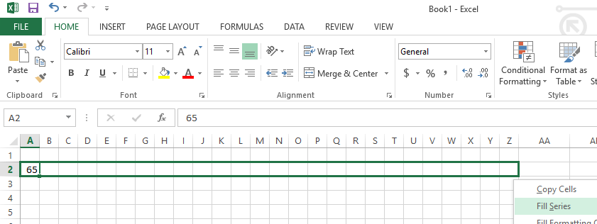

# Build a Caesar Cipher Encryption/Decryption Tool
The [Caesar Cipher](https://learncryptography.com/classical-encryption/caesar-cipher) is one of the simplest forms of encryption. It is a substitution cipher where each letter in the original message (called the plaintext) is replaced with a letter corresponding to a certain number of letters up or down in the alphabet. In this lab we will use Microsoft Excel to build a spreadsheet that we can use to encrypt and decrypt ("crack") a secret coded message.   

Start by creating a new spreadsheet in Excel. Choose *Excel | Blank Workbook*. Start by [using Excels fill handle to create the alphabet] (https://www.techrepublic.com/blog/microsoft-office/using-excels-fill-handle-to-create-an-alphabetic-list/). Type `65` in cell `A2`. Right click on the right bottom of cell `A2` and drag to the right to `fill series` to cell `Z2` as shown below.

Now we'll write a formula in cell `A3` to covert `65` to its ASCII character. Enter the formula `=CHAR(A2)` then left click on the bottom of cell `A3` and fill through cell `Z3` as shown below.   

Now we are going to add a variable so we can introduce different amounts of "shift." Click on cell `A1` and right about it change 'A1' to 'shift'.

